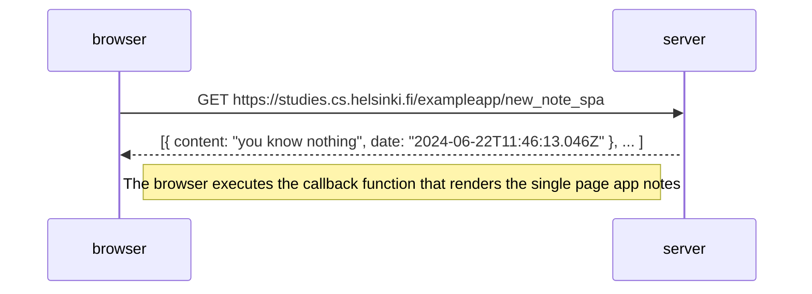

```mermaid
    sequenceDiagram
        participant browser
        participant server

        browser->>server: GET https://studies.cs.helsinki.fi/exampleapp/new_note_spa
        activate server
        server-->>browser: [{ content: "you know nothing", date: "2024-06-22T11:46:13.046Z" }, ... ]

        Note right of browser: The browser executes the callback function that renders the single page app notes
```

